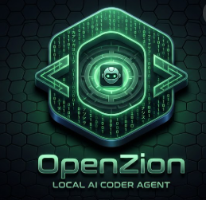

# 🤖 Local Agent — AI Software Engineer for VS Code

<p align="center">
  
</p>

An autonomous AI coding agent that lives inside VS Code and uses your local LLM (via Ollama) to write code, create files, run commands, and complete full development tasks — all without sending your code to the cloud.

---

## ⚡ Quick Install

Download this repo as a ZIP, extract it, then run the installer for your platform.  
It will install VS Code if missing, or update the extension if already installed.

### Step 1 — Download

```
GitHub → Code → Download ZIP → Extract
```

### Step 2 — Run Installer

| Platform | File | How to Run |
|---|---|---|
| 🪟 **Windows** | `install-windows.ps1` | Right-click → **Run with PowerShell** |
| 🍎 **macOS** | `install-mac.sh` | Terminal: `bash install-mac.sh` |
| 🐧 **Linux** | `install-linux.sh` | Terminal: `bash install-linux.sh` |

### Step 3 — Reload VS Code

`Ctrl+Shift+P` (Windows/Linux) or `Cmd+Shift+P` (macOS) → **Reload Window**

> The installer automatically finds the `.vsix` file in the same folder and installs it.

---

## � Requirements

- [VS Code](https://code.visualstudio.com) 1.80+
- [Ollama](https://ollama.com) running locally
- A supported model pulled via Ollama:

```bash
ollama pull qwen2.5-coder:7b    # recommended for coding
ollama pull llama3              # general purpose
ollama pull deepseek-coder:6.7b # alternative
```

---

## ⚙️ Settings

Open VS Code Settings (`Ctrl+,`) and search for **Local Agent**:

| Setting | Default | Description |
|---|---|---|
| `localAgent.apiBaseUrl` | `http://localhost:11434/v1` | Ollama API endpoint |
| `localAgent.modelName` | `llama3` | Model name to use |
| `localAgent.autonomyMode` | `false` | `true` = run tools without asking permission |
| `localAgent.streamResponse` | `false` | `true` = stream LLM responses in real-time |

### Recommended Settings (settings.json)

```json
{
  "localAgent.apiBaseUrl": "http://localhost:11434/v1",
  "localAgent.modelName": "qwen2.5-coder:7b",
  "localAgent.autonomyMode": true,
  "localAgent.streamResponse": true
}
```

---

## 💬 Usage

Open the **Local Agent** panel from the left sidebar and type in natural language:

```
create a pong game in HTML/CSS/JS
build a REST API with Express and SQLite
fix all TypeScript errors in this project
write unit tests for src/utils.ts
```

The agent automatically:
- Creates and edits files (`editFile`)
- Runs terminal commands (`runTerminalCommand`)
- Reads existing files (`readFile`)
- Searches the web for documentation (`searchWeb`, `fetchUrl`)
- Chains multiple actions to complete full tasks

---

## 🎬 Matrix Overlay

While the agent works, a fullscreen Matrix digital rain animation appears with:
- **Top half** — status indicator + falling character animation
- **Bottom half** — real-time log of every action (file paths, commands executed)

| State | Indicator |
|---|---|
| LLM thinking | `⟨ THINKING ⟩ — let the magic happen...` |
| Writing a file | `⟨ WRITING ⟩ — creating file on disk...` |
| Running command | `⟨ EXECUTING ⟩ — running terminal command...` |
| Reading file | `⟨ READING ⟩ — reading file contents...` |

---

## ⌨️ Tips

| Situation | What to do |
|---|---|
| Agent stopped mid-task | Type `continue` or `devam et` |
| Send message while agent is working | Type it — it gets **queued** and sent after current task |
| Cancel current task | Click **■ Stop** |
| Clear chat history | Click **↺** |

---

## 📋 Project Rules — `.agentrules`

Create a `.agentrules` file in **your open project's root folder** (the folder open in VS Code).  
The agent re-reads this file **before every message** — no restart needed. You can edit rules mid-conversation and they take effect immediately.

> **Important:** The agent looks at the folder currently open in VS Code (`File → Open Folder`). If your project is in `D:/MyProject/`, open that folder in VS Code and place `.agentrules` there.

### Example — Python Project

```
# .agentrules
- This project uses Python 3.11.
- Use poetry for package management: poetry add <package>
- Write all files inside the src/ folder.
- Add docstrings to every function.
- Write tests in tests/ using pytest.
- All responses must be in English.
```

### Example — Next.js Project

```
# .agentrules
- Framework: Next.js 14, TypeScript, Tailwind CSS
- Components: src/components/
- API routes: src/app/api/
- Only functional components, never class components.
- Only Tailwind classes, no inline styles.
- Add loading.tsx for every new page.
```

### Example — General Preferences

```
# .agentrules
- Always add error handling.
- Use async/await, not callbacks.
- Add comments for non-obvious logic.
- Keep functions under 30 lines.
```

---

## 🛠️ Custom Skills — `.agent/skills/`

Create a `.agent/skills/` folder in **your open project's root folder** (same rule as `.agentrules` — must be in the folder open in VS Code).  
Each `.md` or `.txt` file inside is a **callable skill** — no TypeScript needed, just plain text instructions.

Skills are also **re-read before every message** — you can add a new skill file mid-conversation and use it immediately.

### Folder Structure

```
YourProject/               ← this folder must be open in VS Code
├── .agent/
│   └── skills/
│       ├── writedocs.md     ← call with: "writedocs for utils.py"
│       ├── writetests.md    ← call with: "writetests for src/api.ts"
│       ├── refactor.md      ← call with: "refactor src/api.js"
│       └── gitcommit.md     ← call with: "gitcommit"
├── .agentrules
└── src/
```

When you mention a skill name in chat, the agent reads its instructions and follows them.

### Example: `writedocs.md`

```markdown
Read the specified source file and generate professional markdown documentation next to it.

Steps:
1. Read the file with readFile.
2. Analyze all functions, classes, and modules.
3. Create [filename].docs.md with editFile containing:
   - File purpose
   - Each function/method: parameters, return value, example usage
   - Important notes
4. Confirm: "Documentation created: [path]"
```

### Example: `writetests.md`

```markdown
Write comprehensive unit tests for the specified file.

Steps:
1. Read the file with readFile.
2. Identify all functions and classes.
3. Write test cases including edge cases.
4. Save as [filename].test.ts (or .test.py) with editFile.
5. Install required test packages with runTerminalCommand.
6. Run the tests and report results.
```

### Example: `refactor.md`

```markdown
Refactor the specified file to modern best practices.

Steps:
1. Read the file with readFile.
2. Apply these improvements:
   - Extract duplicate code into functions
   - var → let/const
   - Callbacks → async/await
   - Magic numbers → named constants
   - Split long functions (max 25 lines)
3. Overwrite the file with editFile.
4. List all changes made.
```

### Example: `gitcommit.md`

```markdown
Create a meaningful Git commit from current changes.

Steps:
1. Run "git diff --stat" with runTerminalCommand.
2. Run "git diff" and analyze changes.
3. Write a conventional commit message (feat/fix/refactor/docs/chore).
4. Run "git add -A".
5. Run "git commit -m '[message]'".
6. Report the commit hash.
```

---

## 🔌 Built-in Tools

| Tool | Description |
|---|---|
| `editFile` | Create or overwrite a file |
| `readFile` | Read file contents |
| `runTerminalCommand` | Execute any shell command |
| `searchWeb` | Search the web |
| `fetchUrl` | Fetch and parse a URL as readable text |

---

## 🧩 Adding New Tools (Advanced)

For developers who want to add built-in tools via TypeScript:

1. Create `src/agent/skills/myTool.ts`:
   ```typescript
   import { ToolContext } from './index';
   export async function myTool(param: string, ctx: ToolContext): Promise<string> {
       // your logic
       return 'result';
   }
   ```

2. Register in `src/agent/skills/index.ts`:
   - Add import
   - Add tool definition to `tools` array
   - Add `case 'myTool':` to `executeTool` switch

3. Rebuild and reinstall:
   ```bash
   npm run package && npx @vscode/vsce package --allow-missing-repository && code --install-extension local-agent-0.1.0.vsix --force
   ```

---

---

# 🇹🇷 Türkçe Dokümantasyon

VS Code içinde çalışan, yerel LLM'inizi (Ollama) kullanan otonom bir AI yazılım mühendisi. Kodunuzu buluta göndermeden dosya yazar, komut çalıştırır ve geliştirme görevlerini tamamlar.

---

## ⚡ Hızlı Kurulum

Bu repoyu ZIP olarak indirin, çıkartın ve platformunuza göre kurulum dosyasını çalıştırın.

### Adım 1 — İndirin

```
GitHub → Code → Download ZIP → Çıkart
```

### Adım 2 — Kurulum Scriptini Çalıştırın

| Platform | Dosya | Nasıl Çalıştırılır |
|---|---|---|
| 🪟 **Windows** | `install-windows.ps1` | Sağ tık → **PowerShell ile Çalıştır** |
| 🍎 **macOS** | `install-mac.sh` | Terminal: `bash install-mac.sh` |
| 🐧 **Linux** | `install-linux.sh` | Terminal: `bash install-linux.sh` |

### Adım 3 — VS Code'u Yeniden Başlatın

`Ctrl+Shift+P` → **Reload Window**

---

## ⚙️ Ayarlar

VS Code Ayarları (`Ctrl+,`) → **Local Agent** arayın:

| Ayar | Varsayılan | Açıklama |
|---|---|---|
| `localAgent.apiBaseUrl` | `http://localhost:11434/v1` | Ollama API adresi |
| `localAgent.modelName` | `llama3` | Kullanılacak model |
| `localAgent.autonomyMode` | `false` | `true` = onay beklemeden çalışır |
| `localAgent.streamResponse` | `false` | `true` = cevapları anlık göster |

### Önerilen Ayarlar

```json
{
  "localAgent.apiBaseUrl": "http://localhost:11434/v1",
  "localAgent.modelName": "qwen2.5-coder:7b",
  "localAgent.autonomyMode": true,
  "localAgent.streamResponse": true
}
```

---

## 💬 Kullanım

Sol panelden **Local Agent**'i açın ve doğal dil ile yazın:

```
bana pong oyunu yap
express ile REST API oluştur, SQLite bağla
projedeki TypeScript hatalarını düzelt
src/utils.ts için unit testler yaz
```

---

## ⌨️ İpuçları

| Durum | Yapılacak |
|---|---|
| Ajan yarıda durdu | `devam et` yazın |
| İş devam ederken mesaj göndermek | Yazın — **sıraya alınır** |
| İptal etmek | **■ Stop** butonuna basın |
| Geçmişi temizlemek | **↺** butonuna basın |

---

## 📋 Proje Kuralları — `.agentrules`

**VS Code'da açık olan klasörün** root'una `.agentrules` dosyası oluşturun.  
Ajan her mesajdan önce bu dosyayı **yeniden okur** — restart gerekmez, konuşma sırasında bile değiştirebilirsiniz.

> **Önemli:** Ajan VS Code'da şu an açık olan workspace'e bakar (`File → Open Folder`). Projeniz `D:/YeniProjem/` klasoründeyse, o klasorü VS Code'da açın ve `.agentrules`’ı oraya koyun.

```
# .agentrules — örnek
- Bu proje Python 3.11 kullanır.
- Paket yöneticisi: poetry add <paket>
- Tüm dosyalar src/ klasörüne yazılsın.
- Her fonksiyona Türkçe docstring ekle.
- Tüm yanıtlar Türkçe olsun.
```

---

## 🛠️ Kendi Skill'lerinizi Tanımlayın — `.agent/skills/`

**VS Code'da açık olan klasörün** root'unda `.agent/skills/` klasörü oluşturun.  
Her `.md` dosyası çağrılabilir bir skill'dir — TypeScript bilmenize gerek yok.

Skill dosyaları da her mesajdan önce yeniden okunur — konuşma sırasında yeni skill ekleyip hemen kullanabilirsiniz.

```
ProjeKlasörü/               ← VS Code'da bu klasör açık olmalı
├── .agent/
│   └── skills/
│       ├── dokumanyaz.md    ← "dokumanyaz utils.py için"
│       ├── testYaz.md       ← "testYaz src/api.ts için"
│       └── gitcommit.md     ← "gitcommit at"
├── .agentrules
└── src/
```

Skill dosyasına ne yapması gerektiğini Türkçe olarak yazmanız yeterli — ajan okur ve araçlarını kullanarak uygular.

---

*Local Agent — Powered by Ollama & VS Code Extension API*
*Local Agent — Powered by Ollama & VS Code Extension API*
